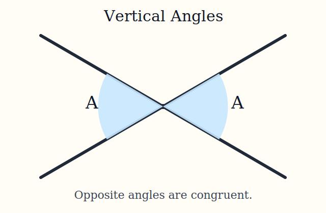
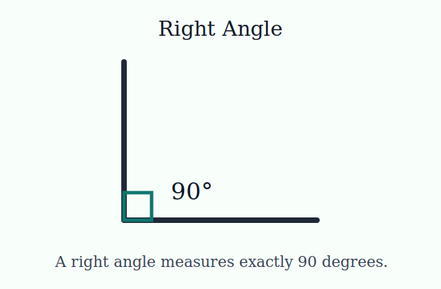

## Learning Goals

By the end of this chapter, you should be able to:

- Distinguish between definitions, postulates, and theorems.
- Plan how you will work through this textbook. This includes making time to read through and work on the material. I do think that this may be the most important step. **You need to arrange your schedule so you are making time for this course.**
- Create a method for remembering and keeping track of key terms and definitions found in this textbook.

::: {.content-visible when-format="html"}
<figure style="text-align:center; margin: 1rem auto;">
	
	<figcaption style="text-align:center; margin-top:0.5rem;">A light bulb to represent a new geometric idea.</figcaption>
</figure>
:::

## Key Terms and Formulas

Geometry can be seen as another language. If math has felt intimidating in the past, that can change with regular practice and review.

::: {.callout-tip}
## Study Strategy

When you see a key term:

- Write it on an index card (physical cards are recommended).
- If you prefer online cards, that is fine too.
- On the back, include the definition and/or an example.
- Review your cards regularly.

Think of geometry as a language: the more consistently you practice it, the more confident you become!
:::

### Definitions

- **Definition**: A statement that explains the precise meaning of a mathematical term.
- **Postulate**: A statement accepted as true without proof and used as a starting point for reasoning.
- **Theorem**: A statement proven true using definitions, postulates, and previously proven results.

## Mini-Lecture

I want you to succeed! Let's go over how you can feel comfortable reading this textbook and how to read it. 

Read this with paper and pens (and highlighters) at hand. I recommend a special binder for this course or a special notebook that is only used for Geoemtry. Write down key definitions, formulas, and concepts to help you remember. You will have textbook exercises, quizzes, and exams so taking notes will help you tremendously! Do the practice problems on your paper. Don't just look at this textbook but work with it and through it. Hope that makes sense!
Please use any calculator that can do square roots. Don't get a calculator that you cannot understand how to work. You need a basic calculator that can add, subtract, multiply, divide, do powers, and take square roots. If it does more great, but it's unnecessary.

You can NOT use a cell phone or tablet as a calculator on the final exam so it is great to practice using the same one the entire time. If you believe you will have an issue using obtaining a calculator for any reason, please let me know by sending me an Email. 

Make time to read for this course. Try not to leave reading until the day assignments are due. That will add stress and frustration. The lectures are inside and you need to go through them in order to score well on the assignments. *You need to answer questions in this course based on the terms used in this text. If you use terms and methods that I do not use it will signal that you may be using AI as a replacement for the lectures. 

These are starter examples, and we will build confidence step by step.

### Examples in Geometry

#### Definitions

- **Point**: An exact location in space with no size.
- **Line segment**: A part of a line with two endpoints.

*These are definitions of terms. We are learning a meaning of mathematical terms.*

#### Postulates

- Through any two distinct points, there is exactly one line.
- A line contains at least two points.

*These are postulates. We accept these statements as true without proving them first.*

#### Theorems

- **Vertical Angles Theorem**: Vertical angles are congruent.
- **All Right Angles Theorem**: All right angles are congruent.

*These are theorems. We prove these statements using definitions, postulates, and other known results.*

<figure style="text-align:center; margin: 1rem auto;">
	
	<figcaption style="text-align:center; margin-top:0.5rem;">Vertical angles are opposite angles formed by intersecting lines.</figcaption>
</figure>

<figure style="text-align:center; margin: 1rem auto;">
	
	<figcaption style="text-align:center; margin-top:0.5rem;">A right angle measures 90 degrees.</figcaption>
</figure>

## Practice

1. Confidence Check: Label each statement as a **Definition**, **Postulate**, or **Theorem**.
	- A line segment is a part of a line with two endpoints.
	- Through any two distinct points, there is exactly one line.
	- Vertical angles are congruent.
2. If you are practicing and working through problems but feel stuck, contact me! Email me and or come to office hours. I will help you!
3. Prepare yourself that the best way to learn math is by practicing problems. I think it is the best way to learn anything and I tell my kids the famous "Practice makes perfect" lime a lot.
4. In the rest of the chapters you will see actual practice problems. I do want you to first figure out how you will be taking notes in this course. Get a binder or notebook ready. 

## Art and Design Connections

- In the rest of the chapters you will see specific connections with our topic to art and design.
- Geometry is everywhere! I have a strong feeling you are wearing something that could be considered geometric right now! Look down. I see tiles on my floor. That is geometry. We will learn more about tiles and be able to classify them! Walk around your neighborhood at the architecture and as you can guess; geometry is there too!
- We are going to create art in this course that happens to involve geometry. Please take a minute to draw a triangle. What kind of triangle did you draw? We will talk about different triangles later. If you didn't draw a triangle (you thought I wouldn't notice) please do so now and we will come back to it in another chapter.

## Creative Assignment

### How Creative Homework Assignments Work

No late work is accepted. The homework assignments are given for you to showcase your creativity. You must turn in unique work (created by you).

Your homework submissions will also give you the opportunity to receive extra credit on exams!

**ALWAYS SUBMIT THROUGH THE PADLET (ONLY).**
The homework done by you and your classmates will be shown in a Padlet. You can show a picture or pictures or a video of what you create.

Make sure you put your full name on the padlet post with your creative homework before the deadline.

You will be looking through what everyone has done and vote for your favorite (as part of your grade). During each module, you will receive a course announcement (which is also sent to your FIT Email) that will ask you to vote for your favorite through a Google Form. Voting is part of the grade! You will have multiple days to vote. If you do not vote on a creative homework assignment within the given time frame you will lose one point of your creative homework assignment grade.

You cannot vote for yourself. Each winning assignment gets +1 on the next exam. So, in the first couple homework assignments the winners will get the points on the midterm. After the midterm, if you win then it will go towards your final exam grade.

How the grading on these creative hw assignments work: You can see my grading rubric right [HERE](https://docs.google.com/document/d/1XxYusEMatYQcfNlGPoCyZbbxzbZ3G3FegVa6Zd4w5RE/edit?usp=sharing). There should be no surprises with grading on anything in this course. Please take the time to carefully read the directions and ask me a question if you are confused about what the assignment is asking. If you did not complete an assignment by the deadline it receives NO CREDIT.

Sometimes students will be awarded +.25, +.5, +.75, or +1 on these assignments by me! This happens for many of the creative homework assignments that show lots of effort. These little values add up so give creative homework your best shot. These extra values go on your exams.

If a student asks for extra credit to help their grade, this is one major area to do so!

### Creative Assignment for this Chapter

For my students: This chapter does not have a creative assignment to submit on a Padlet. Instead you should submit the About You post on a Padlet. 
If you check the course site you will see that it helps me know who my students are when you fill that out.

### Creative Assignment Submission

If you are currently enrolled in a MA142 course from Dr. Jennifer R. Shloming then will be posting on a Padlet every module or unit. 
You need to either:
- Write your name somewhere on the Padlet. 
- Log in to the Padlet using your FIT google account and then post. You will see your name on the padlet post automatically if you do this. I much prefer this for you!
If you log in to the Padlet you will always see your post even if it is on hidden (which all the padlets are initially). If you just post on a padlet without logging in you will not be able to see it.

### Voting on Your Favorite Creative Assignment

* Once we start the creative assignments, voting on your favorite assignment is part of your Creative HW grade!
* The voting form is a Google Form that will be posted as a course announcement around 48 hours after the assignment is due.
* If you forget to vote before the deadline then you will lose a point.

## Exercises

### How Exercises in this OER Work
If you are an FIT student, you will be able to view the Google Doc with specific problems. These are assigned problems that get updated. If you are in one of my (in Dr. Shloming's MA142) courses, these **Textbook Exercises** are part of the course grade. You will do all the questions on the Google Doc. 

### Exercises for this Chapter

* You will see actual exercises in all the other chapters. *

**Please note for the future that you can do the following for Textbook Exercises before you submit on our course site.**

* *If you provide me with more than 24 hours before the due date, then you can share your Google Doc with your answers and work with me for review and comments.*
* *Send a separate Email to me asking for me to look over and make comments on your Google Doc. Again, as long as it is 24 hours or more before the deadline I will be happy to check your work. The earlier you ask, the better!*

### Exercises Submission

In future chapters, once you have worked through the Google Doc Link with the Exercises, you will submit your assignment by going on our Brightspace site. The assignments must be submitted through Brightspace by the date listed in the course schedule. Otherwise, it will receive a zero.

## Quiz

* Remember to complete the Quiz in each chapter on our course site, which is separate than the Textbook Exercises.
* The Quiz for each Module is on our Brightspace course site and must be done before the due date.
* Once the deadline comes, you will be able to review the correct solutions for each quiz.
* A reminder that all the due dates are on the syllabus and in the area of the course site called Course Schedule (Due Dates).

## Further Reading and Interactive Activities

In this area you will usually find links where you can read more on specific topics and work through online, interactive activties.
My favorite site to recommend is https://mathigon.org/

So excited to talk about some of my favorite geometric topics with you! 
