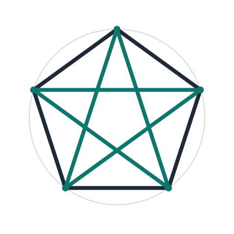
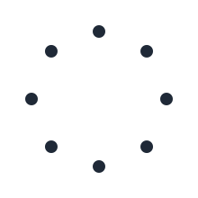
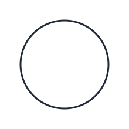
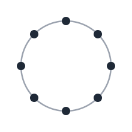
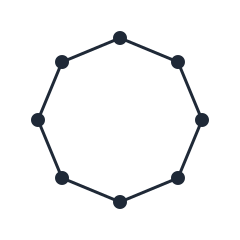

## Learning Goals

- Identify compound and regular star polygons.
- Distinguish when a star polygon is connected or disconnected.
- Compute and recognize identical star polygons.
- Name star polygons.
- Creating star polygons.

::: {.content-visible when-format="html"}
<figure style="text-align:center; margin: 1rem auto;">
   
   <figcaption style="text-align:center; margin-top:0.5rem;">A regular star polygon, shown as a pentagram $\{5/2\}$.</figcaption>
</figure>
:::

## Key Terms and Formulas

A **star polygon** is written as **$\{n/k\}$**:

$$
\{n/k\} \text{ means connect each vertex to the } k\text{th next vertex of a regular } n\text{-gon.}
$$

Two notations can describe the same star polygon:

$$
\{n/k\} = \{n/(n-k)\} \quad \text{(same edges traced in opposite direction).}
$$

The figure is connected exactly when $\gcd(n, k) = 1$.

If $\gcd(n,k)=d>1$, then the figure is disconnected and splits into $d$ identical components.

A **compound star polygon** is formed by overlapping regular polygons (for example, the hexagram as two equilateral triangles).

A regular star polygon can be drawn continuously. In a **regular star polygon**, n and k are **relatively prime**.

### Angle Relationship

For a full tracing of $\{n/k\}$, each step turns by

$$
\theta = \frac{360^\circ k}{n}.
$$

The visible point angle at each star tip is

$$
\alpha = 180^\circ - \theta = 180^\circ - \frac{360^\circ k}{n}.
$$

## Mini-Lecture

### Star Polygons

I want to start you all off with a rare, mathematical topic called Star Polygons. Not only do they make fantastic and impressive doodles, they can be found in the real world in art, a variety of architectural design (the base of the Statue of Liberty, for example), flags, and some even have magical and religious significance (like the pentagram and heptagram).

I was first introduced to a special type of Star Polygon when I was a little girl and my parents bought me a VHS of Donald Duck in Mathmagic Land. You can watch it on YouTube [here](https://www.youtube.com/watch?v=8BqnN72OlqA). It is pretty amazing and has a variety of mathematical ideas. If you watch it, please let me know what you think.

<figure style="text-align:center; margin: 1rem auto;">
   
   <figcaption style="text-align:center; margin-top:0.5rem;">A centered pentagram image of the star polygon "five two" ($\{5/2\}$), the same symbol shown on Donald Duck's hand in the movie.</figcaption>
</figure>

Above you can see the star polygon called "five two", which Donald Duck has on his hand in this movie. You are going to learn how to name Star Polygons, draw them, and more in this mini-lecture.

In general, I like to give definitions first and then explain what it means and then work on examples. So, please do not get scared when you see a definition and are confused. Read the definitions and then look at what comes next and the examples. Then go back to the definition and hopefully it will then make sense. If not, send me an email to clarify anything.

**A Star Polygon is formed by plotting $n$ dots that are equally spaced (on a circle) and connecting every $k$th point with a straight line.**

The $n$ star polygon where every $k$th point is connected is named $\{n/k\}$. I prefer to write it vertically but you can use both ways interchangeably. As you might guess it takes much longer to write it the way I like in an online course.

Now let us explain Star Polygons with an example. We will work with 8 dots/points.

A Star Polygon is formed by plotting $n$ dots and we will work with 8 dots, so $n = 8$.

#### Step 1

**Visualize a circle and place $n$ (8 in this example) equally spaced dots around it.** If it is difficult for you to visualize a circle, you can use an actual circle. In-person I have circle stencils and lightly make one with a pencil. Then I erase traces of the circle after the points are done. (It is difficult to make them equally spaced but try your best. It will look better the bigger your initial circle is and the more accurate you are.) Since we have Google Docs you can make super nice looking ones online.

You can do this step in one shot or in 3 depending on what you feel most comfortable with to end up with 8 equally spaced dots in a circle.

<figure style="text-align:center; margin: 1rem auto;">
   
   <figcaption style="text-align:center; margin-top:0.5rem;">in one step</figcaption>
</figure>

<figure style="text-align:center; margin: 1rem auto; display:flex; justify-content:center; gap:1rem; flex-wrap:wrap;">
   
   
   
</figure>

in three steps

So, for Step 1: Visualize a circle and place $n$ equally spaced dots around it.

--&gt; If we had $n = 10$ then we would have 10 equally spaced dots.

--&gt; If we had $n = 5$ then we have 5 dots in an equally spaced circle.

Try your best to have it equally spaced.

#### Step 2

**Connect every $k$th point with a straight line** (use a ruler or any sort of straight edge, like an index card or a thick piece of paper) to make $\{8/k\}$. **Every dot must be used.**

We are going to draw these:

(a) $\{8/1\}$
(b) $\{8/2\}$
(c) $\{8/3\}$
(d) $\{8/4\}$
(e) $\{8/5\}$

#### (a) Draw $\{8/1\}$

Remember: A Star Polygon is formed by plotting $n$ dots that are equally spaced in a circle and connecting every $k$th point with a straight line. Here we want 8 dots that are equally spaced ($n = 8$) and connect every point where $k = 1$ with a straight line.

   <strong>End of Step 1.</strong>
   

Step 2: we are going to connect every $k$th dot where $k = 1$.

<figure style="text-align:center; margin: 0.75rem auto 1rem auto;">
    
    <figcaption style="text-align:center; margin-top:0.5rem;">Eight equally spaced dots with each dot connected to the next one.</figcaption>
</figure>

#### (b) Draw $\{8/2\}$

Remember: A Star Polygon is formed by plotting $n$ dots that are equally spaced (on a circle) and connecting every $k$th point with a straight line. Here we want 8 dots that are equally spaced ($n = 8$) and connect every second point ($k = 2$) with a straight line.

End of Step 1.

Then we are going to connect every $k$th dot where $k = 2$. If we are connecting every 2nd point then we are doing every other one (skipping one). You can watch me do this [here](https://drive.google.com/a/fitnyc.edu/file/d/1C7Qym1woHQa70dyx6_iyvUUtVmCQQ6jM/view?usp=sharing) and you should get what you see below.

I want you to now do the rest on your own. While you are doing them, ask yourself if you had to lift up your pen or pencil to complete the Star Polygon.

#### (c) $\{8/3\}$

Notice that you do not need to lift up your pen/pencil/mouse to create this Star Polygon.

#### (d) $\{8/4\}$

$\{8/4\}$ was an asterisk.

You MUST lift up your pen/pencil/mouse to create this Star Polygon. Remember that each dot must be used. So, we move over to the next available point after you cannot keep connecting lines.

Did you get confused with how it works? If so, I made a video of me doing (a) Draw $\{8/1\}$, (b) Draw $\{8/2\}$, (c) Draw $\{8/3\}$, (d) Draw $\{8/4\}$ freehand-ish and narrating the process. Please feel free to watch and listen.

#### (e) $\{8/5\}$

$\{8/5\}$ is IDENTICAL to the star polygon $\{8/3\}$.

You do not need to lift up the pen/pencil/mouse to create this Star Polygon.

Do you think you can figure out what $\{8/6\}$ and $\{8/7\}$ look like without drawing them?

They are going to be identical to Star Polygons we already drew. If you are stumped then create $\{8/6\}$ and compare it. What about $\{8/7\}$?

Do you need to lift up your pen/pencil/mouse to create $\{8/6\}$? Do you need to lift up your pen/pencil/mouse to create $\{8/7\}$?

There is a way to know without actually drawing them.

- $\{8/6\}$ is identical to $\{8/2\}$ and $\{8/7\}$ is identical to $\{8/1\}$.
- For $\{8/6\}$ and $\{8/2\}$, you MUST lift up your pen/pencil/mouse.
- For $\{8/7\}$ and $\{8/1\}$, you do NOT need to lift up your pen/pencil/mouse.

Without drawing any Star Polygons for $n = 5$, you should be able to know that $\{5/1\}$ is identical to $\{5/4\}$ and $\{5/2\}$ is identical to $\{5/3\}$.

How can you tell without drawing which ones will be identical?

You can tell without drawing which Star Polygons are going to be identical by using the following:

$$
\{n/k\} = \{n/(n-k)\}
$$

If this formula looks complicated you can just remember that two Star Polygons are identical when the $n$ values are the same and the bottom values added together give you the top. That will tell you which ones will look exactly the same.

How to think about it: If the Star Polygons are the same then they definitely need to have the same $n$, aka the same number of points. You cannot have an 8-pointed Star Polygon be identical to a 7-pointed one. This should make sense, so you only need to think about the $k$ part for figuring these out.

Let us use this to figure out which Star Polygons are identical to (a) $\{10/2\}$, (b) $\{11/2\}$, and (c) $\{7/3\}$.

So we will do this without drawing, using $\{n/k\} = \{n/(n-k)\}$.

(a) $\{n/k\} = \{n/(n-k)\}$ where $n = 10$ and $k = 2$. Plug in: $\{10/(10-2)\}$. This gives us $\{10/8\}$.

So, $\{10/2\}$ is identical to $\{10/8\}$.

Remember: Star Polygons are identical when the $n$ values are the same and the bottom values added together give you the top. $2 + \_ = 10$.

(b) $\{n/k\} = \{n/(n-k)\}$ where $n = 11$ and $k = 2$. Plug in: $\{11/(11-2)\}$. This gives us $\{11/9\}$.

So, $\{11/2\}$ is identical to $\{11/9\}$.

Remember: Star Polygons are identical when the $n$ values are the same and the bottom values added together give you the top. $2 + \_ = 11$.

(c) $\{n/k\} = \{n/(n-k)\}$ where $n = 7$ and $k = 3$. Plug in: $\{7/(7-3)\}$. This gives us $\{7/4\}$.

So, $\{7/3\}$ is identical to $\{7/4\}$.

Remember: Star Polygons are identical when the $n$ values are the same and the bottom values added together give you the top. $3 + \_ = 7$.

That is how we know $\{10/2\} = \{10/8\}$, $\{11/2\} = \{11/9\}$, and $\{7/3\} = \{7/4\}$.

Did you get confused with how identical star polygons are found? If so, I made a video of me doing these three examples and narrating the process. You can watch and listen here.

Okay, let us go back and summarize which identical Star Polygons we have for all $n = 8$:

- $\{8/1\} = \{8/7\}$
- $\{8/2\} = \{8/6\}$
- $\{8/3\} = \{8/5\}$

When you have identical star polygons you do not need to draw the duplicates. You only have to draw UNIQUE ones if you are asked to create all polygons with a certain $n$.

Example: Draw all Star Polygons for $n = 8$.

This means you draw all the Star Polygons that have 8 points around a circle. We name them to make sure we have all accounted for, with $k$ starting at 1 and ending at 7.

- $\{8/1\} = \{8/7\}$
- $\{8/2\} = \{8/6\}$
- $\{8/3\} = \{8/5\}$
- $\{8/4\}$

Above are all the Star Polygons with 8 points.

Let us now talk about which ones require lifting your pen/pencil/mouse and which do not.

Star Polygons are called Regular if you do NOT need to lift up your pen/pencil/mouse while creating them.

Regular Star Polygons are made in one cycle.

Let us name all the Regular Star Polygons for $n = 8$:

- $\{8/1\} = \{8/7\}$
- $\{8/3\} = \{8/5\}$

You can scroll back up to see the animations of these and how you can do it without lifting up your pen/pencil/mouse.

Those Star Polygons that are NOT Regular are called Compound. Compound is a word many of you might associate with "more than one." Here they are called Compound Star Polygons because they are created with more than one cycle, aka you have to lift your pen/pencil/mouse more than once.

Let us name all the Compound Star Polygons for $n = 8$:

- $\{8/2\} = \{8/6\}$
- $\{8/4\}$

Without drawing any Star Polygons for $n = 5$, you will soon be able to tell that all are Regular Star Polygons.

How can you tell without drawing which ones are going to be Regular and which are going to be Compound Star Polygons?

A Regular Star Polygon is denoted by $\{n/k\}$, where $n$ and $k$ are relatively prime (they share no factors except 1) and $k \ge 2$. A Compound Star Polygon has common factors besides 1.

$\{8/2\} = \{8/6\}$ and $\{8/4\}$ are Compound Star Polygons since there are common factors between the $n$ and $k$ values for each.

$\{8/2\}$: $n = 8$ and $k = 2$.

8 and 2 have a common factor of 2, so this is Compound (identical to $\{8/6\}$).

$\{8/4\}$: $n = 8$ and $k = 4$.

8 and 4 have common factors of 2 and 4, so this is Compound.

Let us go over how in Regular Star Polygons the $n$ and $k$ are relatively prime for ones we mentioned:

$\{8/1\}$: $n = 8$ and $k = 1$ (identical to $\{8/7\}$).

8 and 1 have no common factors besides 1. This means the numbers are relatively prime, so this is Regular.

$\{8/3\}$: $n = 8$ and $k = 3$ (identical to $\{8/5\}$).

8 and 3 have no common factors besides 1. This means the numbers are relatively prime, so this is Regular.

$\{5/1\}$: $n = 5$ and $k = 1$ (identical to $\{5/4\}$).

5 and 1 have no common factors besides 1. This means the numbers are relatively prime, so this is Regular.

$\{5/2\}$: $n = 5$ and $k = 2$ (identical to $\{5/3\}$).

5 and 2 have no common factors besides 1. 5 and 2 are relatively prime, so this is Regular.

I just noticed this from typing: R with R and C with C.

Relatively Prime means Regular Star Polygon and Common Factors means Compound Star Polygon. I am way too excited about this but hopefully it will help you remember how to properly classify these Star Polygons.

Let us now make sure you understand what was discussed in this mini-lecture.

Example:

(a) Draw all UNIQUE Star Polygons with 15 points.

(b) Identify which are identical.

(c) Classify them as either Regular Star Polygons or Compound Star Polygons.

When you are ready CLICK HERE to see my answers.

- I try to find something new every time I teach a topic and this time it is a new artwork that involves Star Polygons. From Spring 2024 I found THIS ONE. You can also check out HERE what I found from last semester too.
- My favorite Desmos artist right now is Yodai Obonai who has some beautiful star polygon art and applied it to beautiful mandalas.
- Click here for the animated version. So nice, right?
- I remember loving string art when I was young and tried to make star polygon string art with my children. With minimal effort it was a success and fun for all of us. Pictures are below.
- Feel free to play around with code to see how star polygons change. I recommend changing the number of points of the star, the number of points to skip, and I changed the color and the line thickness to make the three below. Feel free to show me some of your designs if you use this from Khan Academy.
- Trying to create a star polygon without a ruler can be beautiful in its own way. Here I used this site and made the one on the left (star polygon) and the one on the right (a modified star polygon).
- Do you have other ideas on how to use one, multiple star polygons, or modified star polygons? Maybe a logo. Or art that looks like it moves.
- I have a Course FAQ with more examples of what was discussed in this mini-lecture if you want more practice.
- I created the above from Star Polygon Generator.
- My Pinterest board for my courses has more on Star Polygons too. Always feel free to send me a link to any mathematical topic we do. Here it is: https://www.pinterest.com/mathd0rk/for-my-courses/

## Practice

1. Compute the tip angle of $\{7/2\}$.
2. Determine whether $\{8/2\}$ is connected. Explain using $\gcd(n,k)$.
3. Sketch $\{9/4\}$ on a 9-point circle and label one turning angle.
4. Are $\{10/3\}$ and $\{10/7\}$ identical star polygons? Explain.
5. For $\{12/3\}$, determine whether it is connected or disconnected. If disconnected, how many identical components are formed?
6. A designer uses the star polygon $\{11/4\}$. Compute the turning angle $\theta$ and the tip angle $\alpha$.

## Art and Design Connections

- Build star-polygon mandalas using Schlaefli notation and compare how changing $k$ changes visual rhythm and density.
- Recreate a historical Islamic geometric tile using a regular polygon grid, then overlay a matching star polygon construction.
- Design an album-cover graphic with layered $\{n/k\}$ stars and label one turning angle and one tip angle in the final artwork.

## Creative Assignment

### Creative Assignment for this Chapter

(**Creative Homework Assignment #1: Circles/Lines**)

Your first creative assignment is to create an original piece of art using ONLY straight lines and or circles.

- It can be only straight lines or 
- it can be only circles or 
- it can be both straight lines and circles! 

You can decide which of these three options. No additional lines or shapes can be used.

You may be thinking that I want to see Star Polygons but that's truly not what I expect! You are welcome to create an interesting star polygon as it uses only straight lines but ANYTHING goes that involves either circles or straight lines or both!

Please note that you are ONLY using straight lines; no other type of line or you will not get the full credit. If you use any other closed shape beside a circle then you also will not get the full credit. You must turn in unique work (created by you).

### Examples and More Information

* See the module folder on our course site for examples that would get credit and bonus for this creative homework assignment.
* For information on how these assignments work; the grading rubric; and the voting you can look in Chapter 9 of this textbook or many places on our course site!
* The more effort you put in for these assignments, the more bonus you get on exams. It helps if you write how long it took you to complete your work and how you created your assignment.

## Exercises

### Exercises for this Chapter

* Make sure you are logged into your FIT Google account or else you will not view the link below.
* Once you have your answers, submit them carefully through our course site on Brightspace by the deadline.

*The above are the Textbook Exercises for my MA142 students.*

### More Exercises

*These questions are for anyone! They are not required for my students.*

1. **True or False.** The star polygon $\{5/2\}$ is the same as $\{5/3\}$. Explain your reasoning.

2. **Short Answer.** For a star polygon $\{n/k\}$ to be connected (a single piece), the values $n$ and $k$ must be relatively prime (share no common factors greater than 1). Use this rule to determine whether each of the following is connected or disconnected:
   a. $\{8/2\}$
   b. $\{9/2\}$
   c. $\{10/4\}$
   d. $\{7/3\}$

3. **Calculation.** What is the tip angle of the star polygon $\{7/2\}$? Show your work using the angle formula.

4. **Multiple Choice.** Which of the following correctly names the star polygon formed by connecting every 3rd point on a set of 8 equally-spaced points?
   - (a) $\{3/8\}$
   - (b) $\{8/5\}$
   - (c) $\{8/3\}$
   - (d) $\{3/5\}$

5. **Art & Fashion Connection.** The star of David ($\{6/2\}$) and the five-pointed star ($\{5/2\}$) appear everywhere in fashion — on jewelry, printed fabrics, and designer logos. The Givenchy logo famously features interlocking shapes, and star motifs recur in collections by Versace and Saint Laurent.
   - Identify the star polygon notation for a **six-pointed star** formed by two overlapping equilateral triangles. Is it connected or disconnected? How many triangles make it up?
   - The "Star of David" appears on many garments. Sketch or describe how you would construct it starting from 6 equally spaced points on a circle.

## Further Reading and Interactive Activities

* [Creating Star Polygons as String Art](https://mathinunexpectedspaces.wordpress.com/2017/12/10/star-o-rama-and-how-to-make-them/)
* [Star Polygons from Wolfram](https://mathworld.wolfram.com/StarPolygon.html)
