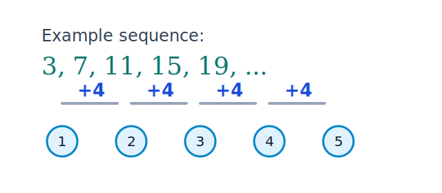

## Learning Goals

- Identify and describe arithmetic and geometric sequences.
- Write explicit and recursive formulas for sequences.
- Use sequence formulas to find terms and partial sums.
- Find the next term in a sequence using the Method of Successive Differences.

::: {.content-visible when-format="html"}
{fig-align="center" width="62%"}
:::

## Key Terms and Formulas

An arithmetic sequence has a constant difference $d$.

$$
a_n = a_1 + (n-1)d
$$

Recursive form:

$$
a_n = a_{n-1}+d, \quad n\ge 2
$$

A geometric sequence has a constant ratio $r$.

$$
a_n = a_1 r^{n-1}
$$

Recursive form:

$$
a_n = r\,a_{n-1}, \quad n\ge 2
$$

Method of Successive Differences:

$$
\Delta a_n = a_{n+1}-a_n
$$

If first differences are constant, the sequence is arithmetic.

Arithmetic series sum (first $n$ terms):

$$
S_n = \frac{n}{2}(a_1 + a_n)
$$

Geometric series sum (first $n$ terms, $r \ne 1$):

$$
S_n = a_1\frac{1-r^n}{1-r}
$$

## Mini-Lecture

An arithmetic sequence starts $5, 8, 11, 14, \dots$.

Here, $a_1=5$ and $d=3$, so

$$
a_n = 5 + (n-1)3 = 3n+2
$$

The 20th term is

$$
a_{20} = 3(20)+2 = 62
$$

## Practice

1. Determine whether each sequence is arithmetic, geometric, or neither: $2,6,18,54,\dots$ and $7,12,17,22,\dots$.
2. Write explicit and recursive formulas for $4,9,14,19,\dots$.
3. Find $a_{12}$ for a geometric sequence with $a_1=3$ and $r=2$.
4. Find the sum of the first 15 terms of $10,13,16,\dots$.
5. A sequence is defined by $a_1=2$ and $a_n=a_{n-1}+5$ for $n\ge2$. Write the explicit formula and compute $a_{10}$.
6. A geometric sequence has $a_1=81$ and $r=\frac{1}{3}$. Find $n$ such that $a_n=1$.
7. Use the Method of Successive Differences to find the next term of $3,8,15,24,\dots$.
8. Find the sum of the first 8 terms of the geometric sequence $5,10,20,40,\dots$.

## Art and Design Connections

- Generate a stripe pattern where widths follow an arithmetic sequence and colors follow a geometric repetition schedule.
- Design staircase typography with letter heights modeled by a sequence and explain the recursive rule used.
- Build a photo-collage grid whose tile counts follow Fibonacci numbers, then discuss balance and focal points.

## Creative Assignment

### Creative Assignment for this Chapter

(**Creative Homework Assignment #2: Number/s**)

Your second creative assignment is to create an original piece of art using a number or numbers.

- You can use a single number as many times as you want or 
- you can choose many different numbers or 
- You can use a single number once. 

You can decide which of these three options. I need to be able to see at least one number.

### Examples and More Information

* See the module folder on our course site for examples that would get credit and bonus for this creative homework assignment.
* For information on how these assignments work; the grading rubric; and the voting you can look in Chapter 9 of this textbook or many places on our course site!
* The more effort you put in for these assignments, the more bonus you get on exams. It helps if you write how long it took you to complete your work and how you created your assignment.

## Exercises

### Exercises for this Chapter

* Make sure you are logged into your FIT Google account or else you will not view the link below.
* Once you have your answers, submit them carefully through our course site on Brightspace by the deadline.

*The above are the Textbook Exercises for my MA142 students.*

### More Exercises

*These questions are for anyone! They are not required for my students.*

1. **Identify the Sequence Type.** For each sequence, state whether it is arithmetic, geometric, or neither. If arithmetic, give the common difference $d$. If geometric, give the common ratio $r$.
   a. $3, 7, 11, 15, 19, \ldots$
   b. $2, 6, 18, 54, \ldots$
   c. $1, 4, 9, 16, 25, \ldots$
   d. $100, 50, 25, 12.5, \ldots$

2. **Write a Formula.** The sequence $5, 8, 11, 14, \ldots$ is arithmetic.
   - Write an **explicit formula** for the $n$-th term.
   - Write a **recursive formula** for the sequence.
   - Use your explicit formula to find the 20th term.

3. **Method of Successive Differences.** Use the Method of Successive Differences to find the next two terms of the sequence: $2, 5, 10, 17, 26, \ldots$

4. **Partial Sum.** Find the sum of the first 10 terms of the geometric sequence $1, 2, 4, 8, \ldots$

5. **Pop Culture Connection.** Taylor Swift's *Eras Tour* had a setlist that grew with each leg of the tour. Suppose the number of songs performed each night followed an arithmetic sequence: the first night she performed 22 songs, and each subsequent night she added 2 more songs to the setlist.
   - Write an explicit formula for the number of songs on night $n$.
   - How many songs would she perform on night 15?
   - If the total number of songs across all nights is 500, how many nights did the tour run? *(Hint: use the partial sum formula and solve for $n$.)*

## Further Reading and Interactive Activities

* [Arithmetic & Geometric Sequences](https://mathigon.org/course/sequences/arithmetic-geometric)
* [Fibonacci Numbers, Golden Ratio, Fibonacci Spirals](https://fitnyc.open.suny.edu/webapps/blackboard/content/listContentEditable.jsp?content_id=_3177055_1&course_id=_74248_1#:~:text=Fibonacci%20Numbers%2C%20Golden%20Ratio%2C%20Fibonacci%20Spirals)
