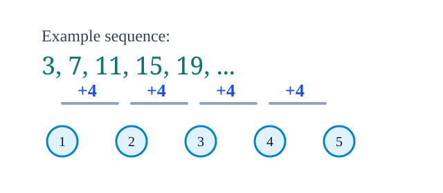

## Learning Goals

- Identify and describe arithmetic and geometric sequences.
- Write explicit and recursive formulas for sequences.
- Use sequence formulas to find terms and partial sums.
- Find the next term in a sequence using the Method of Successive Differences.

::: {.content-visible when-format="html"}

   

:::

## Key Terms and Formulas

An **arithmetic sequence** has a constant difference $d$.

$$
a_n = a_1 + (n-1)d
$$

**Recursive** form:

$$
a_n = a_{n-1}+d, \quad n\ge 2
$$

A **geometric sequence** has a constant ratio $r$.

$$
a_n = a_1 r^{n-1}
$$

**Recursive** form:

$$
a_n = r\,a_{n-1}, \quad n\ge 2
$$

**Method of Successive Differences**:

$$
\Delta a_n = a_{n+1}-a_n
$$

If first differences are constant, the sequence is arithmetic.

Arithmetic series sum (first $n$ terms):

$$
S_n = \frac{n}{2}(a_1 + a_n)
$$

Geometric series sum (first $n$ terms, $r \ne 1$):

$$
S_n = a_1\frac{1-r^n}{1-r}
$$

## Mini-Lecture

### Sequences

We will jump right in.

$3, 7, 11, 15, 19, 23, \ldots$

A **number sequence** is a list of numbers having a first number, a second number, a third number, and so on. These numbers are called **terms**. We use the three dots (ellipsis) in the sequence to indicate it goes on in this pattern forever.

Can you figure out the next term in the sequence above?

What comes after 23:

$3, 7, 11, 15, 19, 23, \ldots$

- There is a pattern going on in this sequence. Some mathematical operation is happening over and over again from one term to the next.
- Each number is obtained by adding 4 to the previous term.
- $23 + 4 = 27$, so 27 is the answer.

I want you to now do the following examples.

::: {.callout-important appearance="simple" icon=false}
**Think About It:** Look for what keeps happening from one term to the next. Once you figure that out, perform the same operation on the last term in each sequence to get the next number.
:::

Determine the probable next number in these sequences:

- Example 1: $1, 2, 4, 8, 16, \ldots$
- Example 2: $1, 1, 2, 3, 5, 8, \ldots$
- Example 3: $3, 9, 15, 21, 27, \ldots$
- Example 4: $5, 10, 20, 40, 80, \ldots$

Have your answers ready?

Let us see how you did.

- Example 1: $1, 2, 4, 8, 16, 32$  
   (You are **multiplying by** 2 to get to the next term.)
- Example 2: $1, 1, 2, 3, 5, 8, 13$  
   (You are **adding** the 2 previous terms to get to the next term.)
- Example 3: $3, 9, 15, 21, 27, 33$  
   (You are **adding** 6 to get to the next term.)
- Example 4: $5, 10, 20, 40, 80, 160$  
   (You are **multiplying by** 2 to get to the next term.)

An **Arithmetic Sequence** is made by **adding** the same value each time. The value being **added** is called the common difference.

In Example 3 we see an arithmetic sequence and it has common difference 6:

$3, 9, 15, 21, 27, 33$

A **Geometric Sequence** is made by **multiplying** the same value each time. The value being **multiplied** is called the common ratio.

In Examples 1 and 4 we see geometric sequences and each has common ratio 2:

$1, 2, 4, 8, 16, 32$ and $5, 10, 20, 40, 80, 160$

$1, 1, 2, 3, 5, 8, 13$ is my favorite sequence. It is not arithmetic nor geometric. It has a special name. Do you remember what it is? We will talk about it soon.

I just want to mention that people use sequences a lot in various ways. You may not be given a sequence written in proper form in your everyday life, but that does not mean you cannot recognize patterns and rewrite data as sequences.

Let us say you are a fairly new influencer and partner with a certain brand in an advertising campaign. You predict the number of hits on a featured post will double each day. You round to the nearest hundred to collect your data.

This rounded data would look like:

| Day | 1 | 2 | 3 | 4 | 5 | ... |
|:---:|:---:|:---:|:---:|:---:|:---:|:---:|
| Hits | 200 | 400 | 800 | 1600 | 3200 | ... |

If your model holds true and continues this way, how many hits will you expect at the end of the week? We will predict day 7.

Write the hits as a sequence:

$200, 400, 800, 1600, 3200, \ldots$

The next term is 6400 (day 6), but we want day 7, so the next term is 12,800 hits (rounded to the nearest hundred).

Can you also classify this sequence as arithmetic, geometric, or neither? Since we multiply by 2 each time, it is geometric.

I now want you to do examples where you determine whether each sequence is arithmetic, geometric, or neither.

::: {.callout-tip appearance="simple" icon=false}
**Check Your Understanding:** Before moving on, make sure you can answer the following:

- Can you distinguish between an arithmetic sequence and a geometric sequence?
- Can you find the common difference in an arithmetic sequence?
- Can you find the common ratio in a geometric sequence?
- What should you do when a sequence appears to be neither arithmetic nor geometric?

If you feel confident about all four, you are ready for the examples below!
:::

Arithmetic, geometric, or neither?

- Example 1: $2, 6, 18, 54, 162, \ldots$
- Example 2: $1, 3, 9, 27, 81, \ldots$
- Example 3: $3, 8, 13, 18, 23, \ldots$
- Example 4: $1, 3, 6, 10, 15, \ldots$
- Example 5: $2, 6, 22, 56, 114, \ldots$

Done? Let us see how you did.

- Example 1: geometric, common ratio 3 (486 is the next term).
- Example 2: geometric, common ratio 3 (243 is the next term).
- Example 3: arithmetic, common difference 5 (28 is the next term).
- Example 4: neither, since there is no common difference nor common ratio (21 is the next term). We are going to talk about this special sequence later on.
- Example 5: neither, since there is no common difference nor common ratio (202 is the next term). Here it is not obvious what the next term is going to be.

You can watch me explain these examples in this video.

### Successive Differences

Often, **the method of successive differences** may be applied to determine the next term in a sequence. This method is especially useful when sequences are more difficult, like

$3, 19, 165, 771, 2503, 6483, 14409, \ldots$

The method of successive differences involves repeated subtraction until the difference is a constant value. Once you have a row of constant values, work backward by adding until the desired term of the original sequence is obtained.

This might sound confusing right now, but after an example or two, you will get the hang of it.

We will start with Example 1 in Section 1.2:

Use the method of successive differences to determine the next number in each sequence.

(a) $14, 22, 32, 44, \ldots$

1. Write the numbers spread out and put a blank for the number we are looking for:

    $14 \quad 22 \quad 32 \quad 44 \quad \underline{\hspace{1.5cm}}$

2. Subtract each term from the next:

    $$
    22-14=8, \quad 32-22=10, \quad 44-32=12
    $$

    Row of first differences: $8, 10, 12, \underline{\hspace{1cm}}$

3. The new row is not constant, so subtract again:

    $$
    10-8=2, \quad 12-10=2
    $$

    Row of second differences: $2, 2, \underline{\hspace{1cm}}$

4. Since the second differences are constant (2), fill in the bottom blank with 2.

5. Work upward by addition:

    - $12 + 2 = 14$
    - $44 + 14 = 58$

So the next term is **58**.

You can watch a video with narration of me doing this example (with help from my son): HERE.

Now work on the same process with part (b):

$5, 15, 37, 77, 141, \ldots$

Set up differences:

- First differences: $10, 22, 40, 64, \underline{\hspace{1cm}}$
- Second differences: $12, 18, 24, \underline{\hspace{1cm}}$
- Third differences: $6, 6, \underline{\hspace{1cm}}$

Once we have the row of constants, work backward:

- Bottom blank is $6$.
- Then $24 + 6 = 30$.
- Then $64 + 30 = 94$.
- Then $141 + 94 = 235$.

So the next term is **235**.

Bringing back Example 5,

$2, 6, 22, 56, 114, \ldots$

this sequence is neither arithmetic nor geometric, and the next term is **202**. You should now be able to see why using successive differences.

I would like you now to work on Exercises 1 and 8 from your text in Section 1.2. Use the method of successive differences to determine the next number in each sequence:

- 1) $1, 4, 11, 22, 37, 56, \ldots$
- 8) $3, 19, 165, 771, 2503, 6483, 14409, \ldots$

For the first exercise, did you get 79? If so, great. If not, check:

- First differences: $3, 7, 11, 15, 19, \underline{\hspace{1cm}}$
- Next row has constant 4.
- Working upward gives 23, then $56 + 23 = 79$.

For number 8, did you get 28,675? Keep trying if not.

- The constant is 120.
- The first blank above 120 is 696.

I have a video of each step on how to do an example like number 8 above (from a decade ago):

Video URL: <https://www.youtube.com/watch?v=v7_LuuyfTcE&feature=youtu.be>

Believe it or not, finding the next term in a sequence is a popular kind of brain teaser.

A game called Wordle is super popular right now (well, it was at the beginning of 2022; now many of my friends stopped but I keep going in 2025). One of my friends posted that there is a sequence version: Times Table Sequence.

Sequences can be visual. We will see that soon. For Example 4 above on arithmetic, geometric, or neither, I made a video showing how $1, 3, 6, 10, 15, \ldots$ can look animated.

You can also turn sequences into sounds and songs.

You also see number sequences every day in NYC, such as house and apartment numbers. We also see certain sequences in nature and food, and we will talk a lot about that in the next mini-lecture.

If I were a professor at Hogwarts, then to protect the stone I would use a difficult successive difference. You all would be able to help save the day.

### Fibonacci Part 1

The Fibonacci sequence begins

$$
1, 1, 2, 3, 5, 8, 13, 21, \dots
$$

Each term is the sum of the two previous terms:

$$
F_1=1, \quad F_2=1, \quad F_n = F_{n-1}+F_{n-2} \text{ for } n\ge 3.
$$

This is a recursive rule. Unlike arithmetic and geometric sequences, the amount added (or multiplied) is not constant.

## Practice

1. Determine whether each sequence is arithmetic, geometric, or neither: $2,6,18,54,\dots$ and $7,12,17,22,\dots$.
2. Write explicit and recursive formulas for $4,9,14,19,\dots$.
3. Find $a_{12}$ for a geometric sequence with $a_1=3$ and $r=2$.
4. Find the sum of the first 15 terms of $10,13,16,\dots$.
5. A sequence is defined by $a_1=2$ and $a_n=a_{n-1}+5$ for $n\ge2$. Write the explicit formula and compute $a_{10}$.
6. A geometric sequence has $a_1=81$ and $r=\frac{1}{3}$. Find $n$ such that $a_n=1$.
7. Use the Method of Successive Differences to find the next term of $3,8,15,24,\dots$.
8. Find the sum of the first 8 terms of the geometric sequence $5,10,20,40,\dots$.

## Art and Design Connections

- Generate a stripe pattern where widths follow an arithmetic sequence and colors follow a geometric repetition schedule.
- Design staircase typography with letter heights modeled by a sequence and explain the recursive rule used.
- Build a photo-collage grid whose tile counts follow Fibonacci numbers, then discuss balance and focal points.

## Creative Assignment

### Creative Assignment for this Chapter

(**Creative Homework Assignment #2: Number/s**)

Your second creative assignment is to create an original piece of art using a number or numbers.

- You can use a single number as many times as you want or 
- you can choose many different numbers or 
- You can use a single number once. 

You can decide which of these three options. I need to be able to see at least one number.

### Examples and More Information

* See the module folder on our course site for examples that would get credit and bonus for this creative homework assignment.
* For information on how these assignments work; the grading rubric; and the voting you can look in Chapter 9 of this textbook or many places on our course site!
* The more effort you put in for these assignments, the more bonus you get on exams. It helps if you write how long it took you to complete your work and how you created your assignment.

## Exercises

### Exercises for this Chapter

* Make sure you are logged into your FIT Google account or else you will not view the link below.
* Once you have your answers, submit them carefully through our course site on Brightspace by the deadline.

*The above are the Textbook Exercises for my MA142 students.*

### More Exercises

*These questions are for anyone! They are not required for my students.*

1. **Identify the Sequence Type.** For each sequence, state whether it is arithmetic, geometric, or neither. If arithmetic, give the common difference $d$. If geometric, give the common ratio $r$.
   a. $3, 7, 11, 15, 19, \ldots$
   b. $2, 6, 18, 54, \ldots$
   c. $1, 4, 9, 16, 25, \ldots$
   d. $100, 50, 25, 12.5, \ldots$

2. **Write a Formula.** The sequence $5, 8, 11, 14, \ldots$ is arithmetic.
   - Write an **explicit formula** for the $n$-th term.
   - Write a **recursive formula** for the sequence.
   - Use your explicit formula to find the 20th term.

3. **Method of Successive Differences.** Use the Method of Successive Differences to find the next two terms of the sequence: $2, 5, 10, 17, 26, \ldots$

4. **Partial Sum.** Find the sum of the first 10 terms of the geometric sequence $1, 2, 4, 8, \ldots$

5. **Pop Culture Connection.** Taylor Swift's *Eras Tour* had a setlist that grew with each leg of the tour. Suppose the number of songs performed each night followed an arithmetic sequence: the first night she performed 22 songs, and each subsequent night she added 2 more songs to the setlist.
   - Write an explicit formula for the number of songs on night $n$.
   - How many songs would she perform on night 15?
   - If the total number of songs across all nights is 500, how many nights did the tour run? *(Hint: use the partial sum formula and solve for $n$.)*

## Further Reading and Interactive Activities

* [Arithmetic & Geometric Sequences](https://mathigon.org/course/sequences/arithmetic-geometric)
* [Fibonacci Numbers, Golden Ratio, Fibonacci Spirals](https://fitnyc.open.suny.edu/webapps/blackboard/content/listContentEditable.jsp?content_id=_3177055_1&course_id=_74248_1#:~:text=Fibonacci%20Numbers%2C%20Golden%20Ratio%2C%20Fibonacci%20Spirals)
