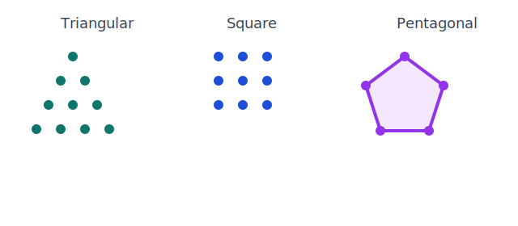

## Learning Goals

- Recognize triangular, square, and pentagonal figurate number patterns.
- Compute terms of the Fibonacci sequence and identify recursive structure.
- Use closed-form and sigma notation to evaluate finite sums.
- Compute figurate numbers using their formulas (triangular, square, and pentagonal).
- Creating figurate numbers as geometric shapes.
- Computing the sum of consecutive integers using Gauss' Method.
- Determine the sum of consecutive even integers.
- Determine the sum of consecutive odd integers.
- Create a FIB poem.
- Recognize a FIB poem.

::: {.content-visible when-format="html"}
{fig-align="center" width="68%"}
:::

## Key Terms and Formulas

Triangular numbers count dots that form an equilateral triangular pattern:

$$
T_n = 1+2+\cdots+n = \frac{n(n+1)}{2}
$$

Square numbers count dots in an $n \times n$ square:

$$
S_n = n^2
$$

Pentagonal numbers:

$$
P_n = \frac{n(3n-1)}{2}
$$

Fibonacci numbers are defined recursively by

$$
F_1=1,\quad F_2=1,\quad F_n=F_{n-1}+F_{n-2}\;\text{for }n\ge 3
$$

Useful finite sums:

$$
\sum_{k=1}^n k = \frac{n(n+1)}{2}, \qquad \sum_{k=1}^n k^2 = \frac{n(n+1)(2n+1)}{6}
$$

Sums of consecutive even and odd integers:

$$
2+4+\cdots+2n = n(n+1), \qquad 1+3+\cdots+(2n-1)=n^2
$$

## Mini-Lecture

Find the 8th triangular number and the sum $1+2+\cdots+8$.

By the triangular-number formula,

$$
T_8 = \frac{8(9)}{2}=36
$$

So,

$$
1+2+\cdots+8 = 36
$$

This shows how figurate-number patterns connect directly to finite sums.

## Practice

1. Compute $T_{12}$ and interpret it as a dot pattern.
2. List the first 10 Fibonacci numbers.
3. Evaluate $\sum_{k=1}^{15} k$.
4. Evaluate $\sum_{k=1}^{10} k^2$.
5. Explain why every square number is the sum of two consecutive triangular numbers.
6. Compute the 7th pentagonal number $P_7$.
7. Use Gauss' Method to find $35+36+\cdots+85$.
8. Find the sum of the first 20 odd integers.
9. Find the sum of the first 20 even integers.

## Art and Design Connections

- Construct dot-art posters for triangular and square numbers, then caption each with its formula and visual growth pattern.
- Design a Fibonacci spiral collage from rectangles with side lengths from the sequence and evaluate composition balance.
- Plan a light-installation layout where LED counts per row follow figurate-number sums to create controlled density gradients.

## Creative Assignment

### Creative Assignment for this Chapter

(***Creative Homework Assignment: FIBS***)

Your creative assignment is to create an original FIB poem that is at least six lines.

It must be a FIB as described in this chapter. This is an extra credit creative assignment that can replace a missing one for the course.

### Examples and More Information

* See the module folder on our course site for examples that would get credit and bonus for this creative homework assignment.

## Exercises

### Exercises for this Chapter

* Make sure you are logged into your FIT Google account or else you will not view the link below.
* Once you have your answers, submit them carefully through our course site on Brightspace by the deadline.

*The above are the Textbook Exercises for my MA142 students.*

### More Exercises

*These questions are for anyone! They are not required for my students.*

1. **Figurate Numbers.** Find the 8th triangular number, the 5th square number, and the 4th pentagonal number. Show the formula you used for each.

2. **Fibonacci Sequence.** The Fibonacci sequence starts $1, 1, 2, 3, 5, 8, \ldots$
   - Write a recursive formula for $F_n$.
   - List the first 12 terms of the Fibonacci sequence.
   - What is the ratio $F_{12}/F_{11}$? What famous constant does this ratio approach?

3. **Gauss's Method.** Use Gauss's Method to find the sum of the integers from 1 to 200. Show your reasoning.

4. **Sigma Notation.** Evaluate: $\displaystyle\sum_{k=1}^{6} (2k - 1)$. What do you notice about the result?

5. **Fashion & Art Connection.** The Fibonacci sequence appears throughout fashion and design. The "golden rectangle" — whose side lengths are in the ratio of consecutive Fibonacci numbers — is used in fabric cutting, logo proportions, and garment design. Karl Lagerfeld was famously inspired by mathematical proportions.
   - The 10th and 11th Fibonacci numbers are 55 and 89. If a designer wants a golden-ratio rectangle with a shorter side of 55 cm, approximately how long should the longer side be?
   - Triangular numbers appear in stacked arrangements — like a pyramid display of folded scarves: 1 on top, then 2, then 3, and so on. If a department store display has 6 rows, how many scarves are in the display in total?

## Further Reading and Interactive Activities

* [Triangle and Square Numbers (and more)](https://mathigon.org/course/sequences/introduction)
* [Figurate Numbers](https://mathigon.org/course/sequences/figurate)
* [Watch Video](https://www.youtube.com/watch?v=Yhlv5Aeuo_k)
* [Pascal's Triangle](https://mathigon.org/course/sequences/pascals-triangle)
* [Gauss](https://mathigon.org/timeline/gauss)
