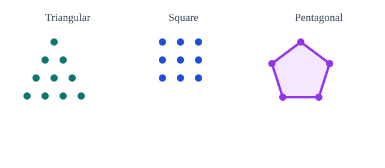

## Learning Goals

- Recognize triangular, square, and pentagonal figurate number patterns.
- Compute terms of the Fibonacci sequence and identify recursive structure.
- Use closed-form and sigma notation to evaluate finite sums.
- Compute figurate numbers using their formulas (triangular, square, and pentagonal).
- Creating figurate numbers as geometric shapes.
- Computing the sum of consecutive integers using Gauss' Method.
- Determine the sum of consecutive even integers.
- Determine the sum of consecutive odd integers.
- Create a FIB poem.
- Recognize a FIB poem.

::: {.content-visible when-format="html"}
<figure style="text-align:center; margin: 1rem auto;">
   
   <figcaption style="text-align:center; margin-top:0.5rem;">Dot patterns for triangular and square figurate numbers.</figcaption>
</figure>
:::

## Key Terms and Formulas

**Triangular numbers** count dots that form an equilateral triangular pattern:

$$
T_n = 1+2+\cdots+n = \frac{n(n+1)}{2}
$$

**Square numbers** count dots in an $n \times n$ square:

$$
S_n = n^2
$$

**Pentagonal numbers**:

$$
P_n = \frac{n(3n-1)}{2}
$$

**Fibonacci numbers** are defined recursively by

$$
F_1=1,\quad F_2=1,\quad F_n=F_{n-1}+F_{n-2}\;\text{for }n\ge 3
$$

Useful **finite sums**:

$$
\sum_{k=1}^n k = \frac{n(n+1)}{2}, \qquad \sum_{k=1}^n k^2 = \frac{n(n+1)(2n+1)}{6}
$$

Sums of **consecutive even and odd integers**:

$$
2+4+\cdots+2n = n(n+1), \qquad 1+3+\cdots+(2n-1)=n^2
$$

## Mini-Lecture

### Number Patterns

A funny joke (to me) is: What will a kid say comes next after 2, 4, 6, 8?
Who do we appreciate?!

Okay... Let us use some sequences we mentioned in the previous module to begin!
$1, 1, 2, 3, 5, 8, \ldots$ and $1, 3, 6, 10, 15, \ldots$ We will now spend some time on the first sequence. Did you think we were done with the Fibonacci sequence? There is so much material related to this, and now we will do one more thing: determine how to tell which Fibonacci numbers are even or odd.

I want you to do the following on your own. You are using number patterns to figure out the next probable terms in these sequences.

::: {.callout-important appearance="simple" icon=false}
**Think About It:** Look for what keeps happening from one term to the next. Once you figure that out, try to get to the 10th term in each sequence below.
:::

| Figurate Number | 1 | 2 | 3 | 4 | 5 | 6 | 7 | 8 | 9 | 10 |
|---|---|---|---|---|---|---|---|---|---|---|
| Triangular | 1 | 3 | 6 | 10 | 15 | ? | ? | ? | ? | ? |
| Square | 1 | 4 | 9 | 16 | 25 | ? | ? | ? | ? | ? |
| Pentagonal | 1 | 5 | 12 | 22 | 35 | ? | ? | ? | ? | ? |

Did you figure out the pattern?

In the first few terms of the sequence, you can see a pattern of whether the numbers are even or odd. Let us write the next six Fibonacci numbers because by then, I bet you will see a pattern.
$1, 1, 2, 3, 5, 8, \_, \_, \_, \_, \_, \_. $

It helps to circle, highlight, or underline which of the numbers from your list are even. Take a second to do this.

Remember, we use $F_n$ to represent Fibonacci numbers. The Fibonacci numbers go odd, odd, even, odd, odd, even, odd, ... Every THIRD number is even. So, if $n$ (in $F_n$) is a multiple of 3, the number is even, and if it is not a multiple of 3, then it is odd.

$1, 1, 2, 3, 5, 8, 13, 21, 34, 55, 89, 144, \ldots$

$F_1\ F_2\ F_3\ F_4\ F_5\ F_6\ F_7\ F_8\ F_9\ F_{10}\ F_{11}\ F_{12}$

Given what we now know, please take a few minutes to do the following examples:

1. **Example 1:** Will the 402nd Fibonacci number be odd or even?
2. **Example 2:** Will $F_{55}$ be odd or even?
3. **Example 3:** Will the 13th Fibonacci number be odd or even?
Have your answers ready?

1. **Example 1 Solution:** The 402nd Fibonacci number is even.
   402 divided by 3 is 134 with no remainder, so $n$ (in $F_{402}$) is a multiple of 3.
   This means $F_{402}$ is even.

2. **Example 2 Solution:** $F_{55}$ is odd.
   55 divided by 3 has a remainder, so $n$ (in $F_{55}$) is NOT a multiple of 3.
   This means $F_{55}$ is odd.

3. **Example 3 Solution:** The 13th Fibonacci number is odd.
   It is the same reasoning as Example 2. 13 divided by 3 has a remainder, so $n$ (in $F_{13}$) is NOT a multiple of 3.
   Also, we just saw that the 12th Fibonacci number is even (144) from our list above. We know that every 3rd number is even, so the next term in the sequence will be odd. However you figured this one out correctly is fine!
   The 13th Fibonacci number is odd.

If you want to hear me explain these with a video, you can watch me go over it here.

$1, 3, 6, 10, 15, \ldots$
Now we are going to discuss the other sequence, which forms the triangular numbers. I am going to add the following two sequences (the square and pentagonal numbers). I will leave you wondering why they are called this until the next mini-lecture. Maybe you will be able to figure it out beforehand!
$1, 4, 9, 16, 25, \ldots$ and $1, 5, 12, 22, \ldots$

### The Method and Legend of Gauss

Find the sum $1+2+\cdots+8$ using Gauss's pairing idea.

Pair the first and last terms:

$$
(1+8),\ (2+7),\ (3+6),\ (4+5)
$$

Each pair sums to $9$, and there are $4$ pairs, so

$$
1+2+\cdots+8 = 4\cdot 9 = 36.
$$

### Figurate Numbers

Now connect this to triangular numbers by finding the 8th triangular number.

By the triangular-number formula,

$$
T_8 = \frac{8(9)}{2}=36
$$

So,

$$
1+2+\cdots+8 = 36
$$

This shows how figurate-number patterns connect directly to finite sums.

### FIBS

Fibonacci numbers build recursively from the two previous terms:

$$
F_1=1,\quad F_2=1,\quad F_n=F_{n-1}+F_{n-2}\;\text{for }n\ge 3.
$$

The first several terms are $1,1,2,3,5,8,13,\ldots$. A FIB poem uses this counting structure for line lengths.

## Practice

1. Compute $T_{12}$ and interpret it as a dot pattern.
2. List the first 10 Fibonacci numbers.
3. Evaluate $\sum_{k=1}^{15} k$.
4. Evaluate $\sum_{k=1}^{10} k^2$.
5. Explain why every square number is the sum of two consecutive triangular numbers.
6. Compute the 7th pentagonal number $P_7$.
7. Use Gauss' Method to find $35+36+\cdots+85$.
8. Find the sum of the first 20 odd integers.
9. Find the sum of the first 20 even integers.

## Art and Design Connections

- Construct dot-art posters for triangular and square numbers, then caption each with its formula and visual growth pattern.
- Design a Fibonacci spiral collage from rectangles with side lengths from the sequence and evaluate composition balance.
- Plan a light-installation layout where LED counts per row follow figurate-number sums to create controlled density gradients.

## Creative Assignment

### Creative Assignment for this Chapter

(***Creative Homework Assignment: FIBS***)

Your creative assignment is to create an original FIB poem that is at least six lines.

It must be a FIB as described in this chapter. This is an extra credit creative assignment that can replace a missing one for the course.

### Examples and More Information

* See the module folder on our course site for examples that would get credit and bonus for this creative homework assignment.

## Exercises

### Exercises for this Chapter

* Make sure you are logged into your FIT Google account or else you will not view the link below.
* Once you have your answers, submit them carefully through our course site on Brightspace by the deadline.

*The above are the Textbook Exercises for my MA142 students.*

### More Exercises

*These questions are for anyone! They are not required for my students.*

1. **Figurate Numbers.** Find the 8th triangular number, the 5th square number, and the 4th pentagonal number. Show the formula you used for each.

2. **Fibonacci Sequence.** The Fibonacci sequence starts $1, 1, 2, 3, 5, 8, \ldots$
   - Write a recursive formula for $F_n$.
   - List the first 12 terms of the Fibonacci sequence.
   - What is the ratio $F_{12}/F_{11}$? What famous constant does this ratio approach?

3. **Gauss's Method.** Use Gauss's Method to find the sum of the integers from 1 to 200. Show your reasoning.

4. **Sigma Notation.** Evaluate: $\displaystyle\sum_{k=1}^{6} (2k - 1)$. What do you notice about the result?

5. **Fashion & Art Connection.** The Fibonacci sequence appears throughout fashion and design. The "golden rectangle" — whose side lengths are in the ratio of consecutive Fibonacci numbers — is used in fabric cutting, logo proportions, and garment design. Karl Lagerfeld was famously inspired by mathematical proportions.
   - The 10th and 11th Fibonacci numbers are 55 and 89. If a designer wants a golden-ratio rectangle with a shorter side of 55 cm, approximately how long should the longer side be?
   - Triangular numbers appear in stacked arrangements — like a pyramid display of folded scarves: 1 on top, then 2, then 3, and so on. If a department store display has 6 rows, how many scarves are in the display in total?

## Further Reading and Interactive Activities

* [Triangle and Square Numbers (and more)](https://mathigon.org/course/sequences/introduction)
* [Figurate Numbers](https://mathigon.org/course/sequences/figurate)
* [Watch Video](https://www.youtube.com/watch?v=Yhlv5Aeuo_k)
* [Pascal's Triangle](https://mathigon.org/course/sequences/pascals-triangle)
* [Gauss](https://mathigon.org/timeline/gauss)
