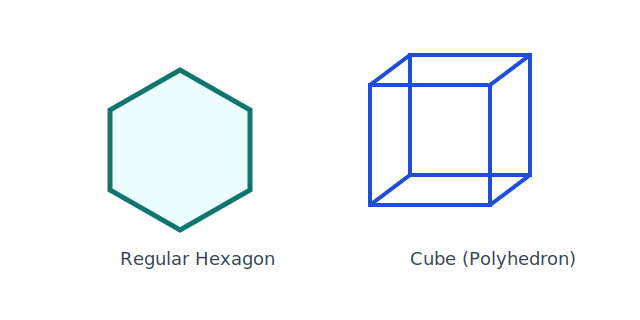

## Learning Goals

- Recognize polygons.
- Identify whether a polygon is regular or irregular.
- Identify whether a polygon is convex or concave.
- Name polygons based on sides.
- Compute the sum of the interior/vertex degrees in a polygon.
- Find the missing angles in a polygon. Find one angle in a regular polygon.
- Classify triangles based on sides.
- Classify triangles based on angles.
- Find all angles in a polygon in terms of a variable.
- Determine the name of a polygon when given the sum of its angles.
- Identify a polyhedron.
- Understand F + V = E + 2.

::: {.content-visible when-format="html"}
<figure style="text-align:center; margin: 1rem auto;">
   
   <figcaption style="text-align:center; margin-top:0.5rem;">A regular polygon and a polyhedron example.</figcaption>
</figure>
:::

## Key Terms and Formulas

For an $n$-gon, interior angle sum is:

$$
(n - 2)180^\circ
$$

Each interior angle of a regular $n$-gon:

$$
\frac{(n-2)180^\circ}{n}
$$

Sum of one exterior angle at each vertex (any convex polygon):

$$
360^\circ
$$

Euler's formula for polyhedra:

$$
F + V = E + 2
$$

Key terms:

- Regular polygon: all sides and all angles are equal.
- Irregular polygon: sides and/or angles are not all equal.
- Convex polygon: all interior angles are less than $180^\circ$.
- Concave polygon: at least one interior angle is greater than $180^\circ$.

## Mini-Lecture

Interior angle sum of a hexagon:

$$
(6 - 2)180^\circ = 720^\circ
$$

## Practice

1. Find each interior angle of a regular pentagon.
2. Relate arc measure to central angle measure.
3. Solve a chord-length reasoning problem from a diagram.
4. Find the sum of the interior angles of a 14-gon, and then find each interior angle if the 14-gon is regular.
5. The interior angles of a quadrilateral are $(x+10)^\circ$, $(x+20)^\circ$, $(x+30)^\circ$, and $(x+40)^\circ$. Find $x$ and all four angles.
6. A polygon has interior-angle sum $1980^\circ$. How many sides does it have, and what is its name?
7. A polyhedron has $F=12$ faces and $V=20$ vertices. Use $F+V=E+2$ to find $E$.

## Art and Design Connections

- Design a radial window pattern using inscribed polygons and circles, then label central angles and intercepted arcs.
- Create a product icon set based on regular polygons and explain how interior-angle structure influences visual tone.
- Draft a dome tile layout where polygon angle sums determine which shapes fit without gaps.

## Creative Assignment

### Creative Assignment for this Chapter

(**Creative Homework Assignment #3: Favorite Polygon**)

Your third creative assignment is to create an original piece of art using your favorite polygon. I bet some of you did not even have a favorite polygon! After some thought maybe you will. Honestly I will not know if it is your actual favorite - the main thing is for you to just pick ONE polygon.

- You can use a polygon once or 
- use the SAME polygon as many times as you want.

*For clarification: if your favorite polygon is a triangle. Your assignment can have one triangle or it can have many triangles. Pick ONE polygon. Just pick one type of polygon. You can add anything else to the assignment aside from polygons. You may see another polygon form automatically but as long as your favorite is clear it is fine.*

### Examples and More Information

* See the module folder on our course site for examples that would get credit and bonus for this creative homework assignment.
* For information on how these assignments work; the grading rubric; and the voting you can look in Chapter 9 of this textbook or many places on our course site!
* The more effort you put in for these assignments, the more bonus you get on exams. It helps if you write how long it took you to complete your work and how you created your assignment.

## Exercises

### Exercises for this Chapter

* Make sure you are logged into your FIT Google account or else you will not view the link below.
* Once you have your answers, submit them carefully through our course site on Brightspace by the deadline.

*The above are the Textbook Exercises for my MA142 students.*

### More Exercises

*These questions are for anyone! They are not required for my students.*

1. **Vocabulary Matching.** Match each term with the correct description:
   - (A) Convex polygon  &emsp; (1) All sides and angles are equal
   - (B) Regular polygon  &emsp; (2) No interior angle greater than 180°
   - (C) Concave polygon  &emsp; (3) At least one interior angle greater than 180°

2. **Interior Angle Sum.** Find the sum of the interior angles for each polygon:
   a. Hexagon
   b. Decagon (10 sides)
   c. 15-gon

3. **Find the Missing Angle.** A pentagon has four interior angles measuring 90°, 105°, 118°, and 97°. What is the measure of the fifth angle?

4. **Triangle Classification.** Classify each triangle (a) by its sides and (b) by its angles:
   - Triangle 1: sides 5, 5, 8; angles 75°, 75°, 30°
   - Triangle 2: sides 3, 4, 5; angles 90°, 53°, 37°
   - Triangle 3: sides 6, 6, 6; angles 60°, 60°, 60°

5. **Fashion & Design Connection.** Gemstone cuts are closely tied to polygon geometry. The classic **emerald cut** is an octagon (8-sided polygon), and the **princess cut** is based on a square. Jewelers in the fashion industry choose cuts based on brilliance and geometric appeal.
   - What is the measure of each interior angle of a **regular octagon**? Show your work.
   - A custom pendant is cut in the shape of a regular hexagon. If each side measures 1.2 cm, what is the sum of the interior angles? Is this polygon convex or concave?

## Further Reading and Interactive Activities

* [Dodecahedron Video](https://youtu.be/UgGcg7PTDmU)
* [Polygons](https://mathigon.org/course/polyhedra/polygons)
* [Polyhedra](https://mathigon.org/course/polyhedra/polyhedra)
* [Platonic Solids](https://mathigon.org/course/polyhedra/platonic)
* [Animated Polyhedron Models](https://www.mathsisfun.com/geometry/polyhedron-models.html?m=Dodecahedron)
* [Play with 3d Polyhedra Online](https://drajmarsh.bitbucket.io/poly3d.html)
