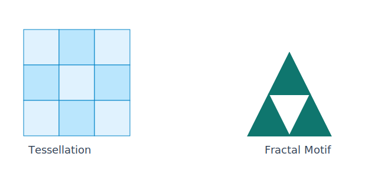

## Learning Goals

- Identify all the regular tessellations.
- Classify a tiling as regular, semi-regular, or neither.
- Name and identify all the regular and semi-regular tessellations.
- Create dual tilings.
- Identify which polygons will work in a regular or semi-regular tiling (check to see if the sum is 360 degrees around a given vertex).
- Define a fractal.
- Identify famous fractals.

::: {.content-visible when-format="html"}
{fig-align="center" width="64%"}
:::

## Key Terms and Formulas

- A tessellation is a tiling of the plane with no gaps and no overlaps.

- Regular tessellation: uses one type of regular polygon only.

- The only regular polygons that tessellate by themselves are:

$$
\text{equilateral triangles, squares, and regular hexagons}
$$

- Interior angle of a regular $n$-gon:

$$
\alpha_n = \frac{(n-2)180^\circ}{n}
$$

- Vertex condition for a tessellation:

$$
\alpha_1+\alpha_2+\cdots+\alpha_m = 360^\circ
$$

- Semi-regular tessellation: made from two or more regular polygons with the same arrangement at every vertex.

- Fractal: a self-similar pattern repeated at different scales.

- Example (Sierpinski-style triangle count by step):

$$
N_n = 3^n
$$

## Mini-Lecture

A cylinder with radius 3 and height 10 has volume:

$$
V = \pi r^2 h = \pi(3)^2(10) = 90\pi
$$

## Practice

1. Name all regular tessellations.
2. Determine whether a regular pentagon can tessellate the plane by itself. Justify using angle measures.
3. Check whether a vertex arrangement of triangle-square-hexagon-square forms a valid tessellation at a vertex.
4. Classify each tiling as regular, semi-regular, or neither: (a) all squares, (b) triangles and hexagons with one repeating vertex pattern, (c) mixed polygons with inconsistent vertex patterns.
5. In a Sierpinski-style triangle pattern, the number of filled triangles follows $N_n=3^n$. Find $N_4$ and $N_6$.
6. Briefly explain what self-similarity means in fractals and name one famous fractal.

## Art and Design Connections

- Create a repeat textile print using one or two tessellating polygons and document the translation vectors.
- Build a fractal-inspired poster by iterating a motif at smaller scales, then discuss self-similarity and visual depth.
- Compare two mural plans by estimating covered area and paint volume to connect pattern design with measurement constraints.

## Creative Assignment

### Creative Assignment for this Chapter

(**Creative Homework Assignment #4: Tessellations**)

Your fourth creative assignment is to create an original piece of art involving tessellations. In order for it to be a tessellation remember there can be no gaps or overlaps. You can create a regular tiling, irregular tiling, or a dual tiling; anything you want that is or includes a tessellation is fine!

### Examples and More Information

* See the module folder on our course site for examples that would get credit and bonus for this creative homework assignment.
* For information on how these assignments work; the grading rubric; and the voting you can look in Chapter 9 of this textbook or many places on our course site!
* The more effort you put in for these assignments, the more bonus you get on exams. It helps if you write how long it took you to complete your work and how you created your assignment.

## Exercises

### Exercises for this Chapter

* Make sure you are logged into your FIT Google account or else you will not view the link below.
* Once you have your answers, submit them carefully through our course site on Brightspace by the deadline.

*The above are the Textbook Exercises for my MA142 students.*

### More Exercises

*These questions are for anyone! They are not required for my students.*

1. **True or False.** Every regular polygon can tessellate the plane on its own. If false, give a counterexample.

2. **Angle Check.** Determine whether each regular polygon can tessellate the plane by checking if its interior angle evenly divides 360°.
   a. Equilateral triangle
   b. Regular pentagon
   c. Regular hexagon
   d. Regular octagon

3. **Semi-Regular Tessellation.** A vertex in a tiling is surrounded by a regular triangle, a square, a regular hexagon, and another square (in some order). Do these polygons form a valid tiling at that vertex? Show by computing the angle sum.

4. **Fractals.** The Sierpiński triangle is formed by repeatedly removing the middle triangle from each remaining triangle.
   - After Step 0 there is 1 filled triangle. After Step 1 there are 3. After Step 2 there are 9. Write a formula for the number of filled triangles after Step $n$.
   - What type of sequence is this (arithmetic or geometric)?

5. **Art Connection.** The artist M.C. Escher is famous for his tessellations that transform geometric shapes into animals, birds, and fish. His work *Sky and Water I* (1938) features interlocking fish and birds with no gaps or overlaps.
   - In your own words, what property must a shape have in order to tessellate the plane?
   - Escher often started with a regular polygon and modified its edges. If he started with a square (interior angle = 90°), how many squares meet at each vertex in a standard square tessellation? Verify this using the angle sum.
   - **Creative prompt:** Describe or sketch how you might modify one side of an equilateral triangle to create an Escher-like interlocking shape that would still tessellate.

## Further Reading and Interactive Activities

* [Tessellations @ Mathigon](https://mathigon.org/course/polyhedra/tessellations)
* [Magic Square @ Mathigon](https://mathigon.org/task/puzzling-properties-of-magic-square)
* [Tangram @ Mathigon](https://mathigon.org/tangram)
* [Tessellate](https://www.youtube.com/watch?v=lCeYBfZiDTY)
* [Escher-style coloring pages](http://krokotak.com/2012/11/escher-coloring-pages/)
* [mathcats' tessellation town](http://www.mathcats.com/explore/tessellations/tesspeople.html)
* [Fractals](https://mathigon.org/course/fractals/introduction)
* [Sierpinski Triangle](https://mathigon.org/course/fractals/sierpinski)
* [How Mandelbrot's fractals changed the world](https://www.bbc.com/news/magazine-11564766)
