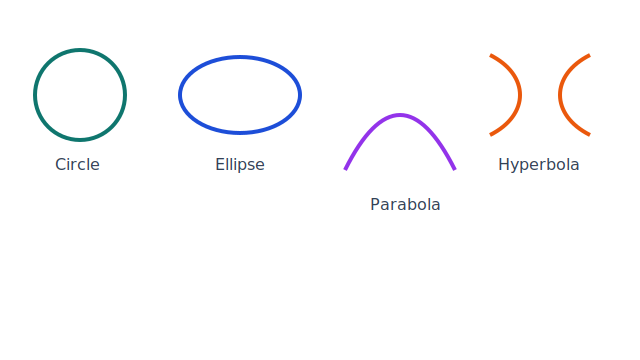

## Learning Goals

- Describe conic sections.
- Define cylinder, cone, sphere, ellipse, parabola, hyperbola, circle.
- Compute using the volume formula for cylinders.
- Compute using the volume formula for cones.
- Compute using the volume formula for spheres.
- Compute using the surface area formula for cylinders.
- Compute using the surface area formula for cones.
- Compute using the surface area formula for spheres.
- Describe Planetary Orbits.
- Defy Gravity. (Just Kidding) instead we will Define Gravity.
- Recognize the contributions of Isaac Newton, Hypatia, and Kepler in relation to Conic Sections.

::: {.content-visible when-format="html"}
{fig-align="center" width="66%"}
:::

## Key Terms and Formulas

- Conic sections are formed by intersecting a plane with a cone: circle, ellipse, parabola, and hyperbola.

- Cylinder:

$$
V = \pi r^2 h, \qquad SA = 2\pi rh + 2\pi r^2
$$

- Cone (with slant height $\ell$):

$$
V = \frac{1}{3}\pi r^2 h, \qquad SA = \pi r\ell + \pi r^2, \qquad \ell = \sqrt{r^2+h^2}
$$

- Sphere:

$$
V = \frac{4}{3}\pi r^3, \qquad SA = 4\pi r^2
$$

- Planetary orbits are ellipses with the Sun at one focus (Kepler).

## Mini-Lecture

Transformations describe how figures move on the coordinate plane while preserving or changing size in predictable ways. By applying transformation rules step by step, you can map original points to image points and explain the symmetry of the result.

## Practice

1. Match each conic to a plane cut description: circle, ellipse, parabola, hyperbola.
2. Compute the volume and total surface area of a cylinder with radius 4 cm and height 9 cm.
3. A cone has radius 5 cm and height 12 cm. Find its slant height, then compute total surface area.
4. Find the volume and surface area of a sphere with radius 6 cm.
5. True or False: A circle is a special case of an ellipse. Explain briefly.
6. Short response: State one contribution each from Kepler, Newton, and Hypatia related to conics, gravity, or planetary motion.

## Art and Design Connections

- Photograph real conics in architecture (arches, spotlights, domes) and classify each as parabola, ellipse, or hyperbola.
- Design a typography poster using ellipse and parabola guides to control letter curvature and spacing.
- Create a gallery floor plan that uses translated and reflected conic motifs for wayfinding graphics.

## Creative Assignment

### Creative Assignment for this Chapter

(**Creative Homework Assignment: Conic Section**)

Your creative assignment is to create an original piece of art that involves one or more conic section.

- It can be only one conic section or 
- it can be multiple conic sections or 
- it can be one type of conic section many times! 

You can decide which of these three options. You can do this in any way you want. This is another extra credit creative assignment that can replace a missing one for the course.

### Examples and More Information

* See the module folder on our course site for examples that would get credit and bonus for this creative homework assignment.
* For information on how these assignments work; the grading rubric; and the voting you can look in Chapter 9 of this textbook or many places on our course site!
* The more effort you put in for these assignments, the more bonus you get on exams. It helps if you write how long it took you to complete your work and how you created your assignment.

## Exercises

### Exercises for this Chapter

* Make sure you are logged into your FIT Google account or else you will not view the link below.
* Once you have your answers, submit them carefully through our course site on Brightspace by the deadline.
- [Conic Sections Exercises (Google Doc)](https://docs.google.com/document/d/10OcsnlokYO7z1wRT5nPUskJUs1u3-0VP55SpWxNbqMQ/edit?usp=sharing)

*The above are the Textbook Exercises for my MA142 students.*

### More Exercises

*These questions are for anyone! They are not required for my students.*

1. **Matching.** Match each conic section to how it is formed by a plane cutting a cone:
   - (A) Circle  &emsp; (1) Plane cuts both nappes of the cone
   - (B) Ellipse  &emsp; (2) Plane is parallel to the base of the cone
   - (C) Parabola  &emsp; (3) Plane cuts at an angle but only one nappe
   - (D) Hyperbola  &emsp; (4) Plane is parallel to one slant side of the cone

2. **Volume Calculations.** Round answers to the nearest hundredth where needed ($\pi \approx 3.14159$).
   a. Find the volume of a cylinder with radius 4 cm and height 10 cm.
   b. Find the volume of a cone with radius 3 cm and height 9 cm.
   c. Find the volume of a sphere with radius 5 cm.

3. **Surface Area.** A soup can (cylinder) has radius 3.5 cm and height 11 cm. Find the total surface area. Show all steps.

4. **Planetary Orbits.** Earth orbits the Sun in an elliptical path with the Sun at one focus.
   - True or False: A perfect circle is a special case of an ellipse.
   - Which planet in our solar system has the most circular orbit (closest to a perfect circle), and which has the most elongated (eccentric) elliptical orbit? *(Research or reason from what you know.)*

5. **Pop Culture & Design Connection.** Ellipses and parabolas appear throughout architecture and product design. The famous Levi's Stadium, many satellite dishes, and car headlight reflectors all use parabolic shapes. The Oval Office in the White House takes its name from its elliptical shape.
   - Why is a **parabolic** shape used for satellite dishes and car headlights? Describe in terms of the reflective property of a parabola.
   - A decorative bowl is designed as a hemisphere (half-sphere) with an inner radius of 12 cm. What is the volume of liquid it can hold? *(Hint: the volume of a hemisphere is half the volume of a sphere.)*

## Further Reading and Interactive Activities

* [Spheres, Cones and Cylinders -- Mathigon](https://mathigon.org/course/circles/spheres-cones-cylinders)
* [Conic Sections -- Mathigon](https://mathigon.org/course/circles/conic-sections)
* [Painting - Cross-Ratio in a Conic (Poncelet)](https://www.si.edu/object/painting-cross-ratio-conic-poncelet%3Anmah_694639)
* [Ellipsographs -- Smithsonian](https://americanhistory.si.edu/collections/object-groups/ellipsographs)
* [Conic Sections - interactive 3-D graph](https://www.intmath.com/plane-analytic-geometry/conic-sections-summary-interactive.php)
* [Extra History videos related to Hypatia](https://www.youtube.com/@extrahistory/search?query=hypatia)
