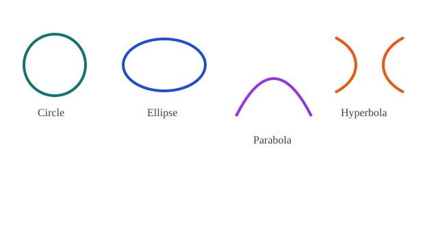
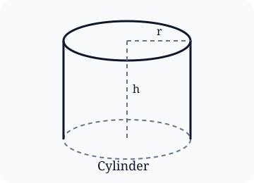
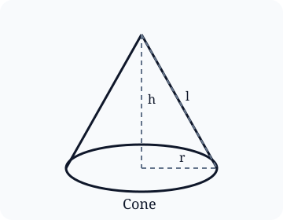
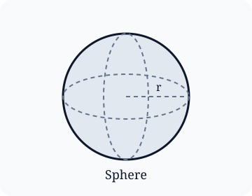

## Learning Goals

- Describe conic sections.
- Define cylinder, cone, sphere, ellipse, parabola, hyperbola, circle.
- Compute using the volume formula for cylinders.
- Compute using the volume formula for cones.
- Compute using the volume formula for spheres.
- Compute using the surface area formula for cylinders.
- Compute using the surface area formula for cones.
- Compute using the surface area formula for spheres.
- Describe Planetary Orbits.
- Defy Gravity. (Just Kidding) instead we will Define Gravity.
- Recognize the contributions of Isaac Newton, Hypatia, and Kepler in relation to Conic Sections.

::: {.content-visible when-format="html"}
<figure style="text-align:center; margin: 1rem auto;">
   
   <figcaption style="text-align:center; margin-top:0.5rem;">The four classic conic sections: circle, ellipse, parabola, and hyperbola.</figcaption>
</figure>
:::

## Key Terms and Formulas

- **Conic sections** are formed by intersecting a plane with a cone: circle, ellipse, parabola, and hyperbola.

$$
V = \pi r^2 h, \qquad SA = 2\pi rh + 2\pi r^2
$$

{fig-alt="Cylinder diagram" width=46%}

**Cylinder**

$$
V = \frac{1}{3}\pi r^2 h, \qquad SA = \pi r\ell + \pi r^2, \qquad \ell = \sqrt{r^2+h^2}
$$

{fig-alt="Cone diagram" width=46%}

**Cone**

$$
V = \frac{4}{3}\pi r^3, \qquad SA = 4\pi r^2
$$

{fig-alt="Sphere diagram" width=46%}

**Sphere**

- Planetary orbits are ellipses with the Sun at one focus (Kepler).

## Mini-Lecture

### Spheres, Cones, and Cylinders

Let us take a few minutes to spin around the shapes on the top of this page:
[Spheres, Cones and Cylinders - Circles and Pi - Mathigon](https://mathigon.org/course/circles/spheres-cones-cylinders)

Below is a less than one minute soundless video of me interacting with the shapes so you can visualize them and see their definitions.
Spheres, Cones and Cylinders - Circles and Pi - Mathigon - Watch Video

Spheres, cones, and cylinders are everywhere and also are inspiration for both fashion and artistic expression.
When I think of cones a certain fashion statement comes to mind. Let us see if it does for you too. From our own FIT site we have 1984 - Jean Paul Gaultier, Cone bra corset dress | Fashion History Timeline.
I would say the most famous person (aside from Gaultier) associated with the cone bra is Madonna. Do you agree? You can read more about the cone bra and when Madonna wore it in the link above. Fun fact: Madonna first wore a Gaultier corset bra in the music video for her song "Vogue" on YouTube.

There is a certain type of sphere that I think of when it comes to fashion: the pearl. Maybe at some point I will wear some sort of pearly jewelry but for now I definitely appreciate its timelessness. A History of Pearls In Fashion and Pop Culture. In the link you will see some Met Gala looks involving pearls, menswear from Louis Vuitton with pearls, and famous icons in their pearls.

Before we go on let us make sure you can quickly identify the sphere, cylinder, and cone from the image below. If you do not know the answer right away then scroll back to the top of this mini-lecture where I asked you to play on the Mathigon site and see the definitions of these three space figures.

*(Image from Canva showing a sphere, cylinder, and cone, not in that order, as students are asked to identify which is which.)*

Look at the space figures above again. They each show a radius, which we denote with $r$. Two show the height, which is denoted with $h$.
We are going to talk about volume and surface areas. Do you remember learning either of these formulas at some point in school?

Maybe you kind of do but not the exact formula. We will go over them and be sure to write them down. For the final exam you can bring a sheet (one side with the frieze pattern chart and the other with whatever you want written on it), and I suggest writing down these formulas. We will start with Volume ($V$), which I believe is more familiar to you all.

*(Image from Canva showing a sphere, cylinder, and cone, not in that order, and their respective volume formulas.)*

A cylinder is a three-dimensional solid with congruent circular bases that are parallel. The space between the circles is enclosed.
-> Cylinder: $V = \pi r^2 h$

A cone is a three-dimensional solid with a circular base that is connected to a vertex (single point). This can be thought of as a circular pyramid.
-> Cone: $V = \frac{1}{3}\pi r^2 h$

A sphere is a three-dimensional solid consisting of all points that have the same distance from its center. This distance is called the radius of the sphere.
-> Sphere: $V = \frac{4}{3}\pi r^3$

If a cone and a cylinder have the same base and the same height, the cone's volume is exactly one-third of the cylinder's volume. You may have noticed the relationship when looking at the formulas.

Now for some rapid fire questions where you say out loud or in your head (but it would be fun if you were reading this in a library and start naming space figures) which of the three I am talking about: cylinder, sphere, or cone.

Tennis ball?
Soda can?
Party hat?
Mars?
Pipe (like in Mario)?

*(Image of pipes as seen in a Mario video game.)*

Tennis ball is a type of sphere. Soda can is a cylinder. Party hat is a cone. Mars is a sphere. Pipe (like in Mario) is a cylinder.

Surface areas are trickier formulas but again, you can write them down carefully and use them when you do calculations. Make sure to put them on the paper you bring into the final exam. Surface area applications can be found in many different fields, especially in construction and architecture. Surface area is the amount of space covering the outside of a 3D shape.

Surface area, according to our textbook, is the total area that would be covered if the space figure were "peeled" off and then that peel was laid down flat. I like thinking about it that way. Surface area is measured in square units. Pages 539-541 in our book have the formulas and examples for these figures. While the surface area formulas for cylinder and sphere should be the same everywhere you look, the cone may look different. I like the explanation of the formula better on the Mathigon site where you interactively figure it out. Please work through the surface area of a cone part on the Mathigon site before looking below.

The Surface Area of the Cone has two parts:

There is a base area, which is a circle. That is the bottom part of the picture.
This means the area of the base part would be $\pi r^2$. There is the other part (that was not a flat circle), which is what you figure out interactively on the site. To figure out the formula you need to remember the famous Pythagorean theorem: $a^2 + b^2 = c^2$, where $c$ is the hypotenuse.

A cone's surface area starts as
$\pi rs + \pi r^2$,
but we usually replace the slant height for the final formula, which makes it look a bit intense, which is why I wanted to explain it a bit here before you see it in a minute.

Let us replace $s$ in terms of the other variables:
$\pi r\sqrt{r^2 + h^2} + \pi r^2$

This gives us our final formula:
-> Cone's Surface Area: $\pi r\sqrt{r^2 + h^2} + \pi r^2$

Now we are ready to put our surface area formulas down on index cards and/or notes. I would recommend you bring these formulas in for the final exam.
(Read more about what you can and cannot bring for the final on our course site in the Final Information folder. If you have any questions, please email me.)

The Surface Area of the Cylinder has two parts:
The top and bottom (circles) $= 2\pi r^2$ and the side area $= 2\pi rh$
-> Cylinder's Surface Area: $2\pi rh + 2\pi r^2$

The Surface Area of the Cone has two parts:
The base area $= \pi r^2$ and the side area $= \pi rs$ (where $s$ is the slant length).
-> Cone's Surface Area: $\pi r\sqrt{r^2 + h^2} + \pi r^2$

The Surface Area of the Sphere is straightforward:
-> Sphere's Surface Area: $4\pi r^2$

Let us do some calculations now. First from the textbook, then the ones listed at the top of this mini-lecture.
Let us take an ice cream cone with a radius of 2 cm and a perpendicular height of 6 cm.
Example: How much ice cream can it hold?

First, what are we talking about when we want to know how much ice cream can go in a cone? Is that surface area or volume? We are filling up the shape so we are talking about the volume.
We also need to realize what space figure we have in order to make sure we have the correct formula.
-> Cone: $V = \frac{1}{3}\pi r^2 h$

We are given the radius and the height, which is all we need.
Plug in the values: $r = 2$ cm and $h = 6$ cm.

$$
V = \frac{1}{3}\pi r^2 h
$$

$$
V = \frac{1}{3}\pi (2)^2(6) = \frac{1}{3}\pi(24) = 8\pi\ \text{cm}^3
$$

This cone can hold $8\pi\ \text{cm}^3$ (about $25.12\ \text{cm}^3$ if you use $\pi \approx 3.14$) of ice cream.

Let us pretend the Earth is a perfect sphere with a radius of approximately 6,378 kilometers.
Example: What is the approximate volume of Earth?

-> Sphere: $V = \frac{4}{3}\pi r^3$

We are given the radius, which is all we need.
Plug in $r = 6{,}378$ km.

$$
V = \frac{4}{3}\pi(6378)^3
$$

Example: What is the approximate surface area of Earth (the area of its crust)?

In the problem we are pretending Earth is a perfect sphere, so we use:
-> Sphere: $SA = 4\pi r^2$

Plug in $r = 6{,}378$ km.

$$
SA = 4\pi(6378)^2
$$

Try to solve these on your own, and we will go over them step by step after you are done.

A water tank in your building (shaped like a cylinder) has a radius of 2 meters and a height of 5 meters. What is its volume? (Leave in terms of $\pi$.)

A bowling ball has a radius of 10.8 cm. What is its surface area? (Round to two decimal places using $\pi \approx 3.14$.)

Find the surface area of a cone that has a height of 7 inches and a radius of 2 inches.
Find the surface area of a cylinder that has a height of 7 inches and a radius of 2 inches.
Find the volume of a sphere that has a radius of 5 inches.

Okay, let us go over these. But if you have not done it yet, please try them on your own before scrolling down.

D) Water tank is a cylinder: $V = \pi r^2 h$
Given $r=2$ m and $h=5$ m:

$$
V = \pi(2)^2(5) = 20\pi\ \text{m}^3
$$

E) Bowling ball surface area:

$$
SA = 4\pi r^2 = 4\pi(10.8)^2 \approx 1464.998\ \text{cm}^2
$$

F) Cone surface area with $h=7$ in and $r=2$ in:

$$
SA = \pi r\sqrt{r^2+h^2} + \pi r^2 = \pi(2)\sqrt{2^2+7^2}+\pi(2)^2 = 18.56\pi\ \text{in}^2
$$

G) Cylinder surface area with $h=7$ in and $r=2$ in:

$$
SA = 2\pi rh + 2\pi r^2 = 2\pi(2)(7)+2\pi(2)^2 = 36\pi\ \text{in}^2
$$

H) Sphere volume with $r=5$ in:

$$
V = \frac{4}{3}\pi(5)^3 = \frac{500}{3}\pi\ \text{in}^3 \approx 166.667\pi\ \text{in}^3
$$

Now let us do Examples 2 and 3 in Section 9.5.

In Example 2 we are talking about a cylinder and surface area:
-> Cylinder's Surface Area: $2\pi rh + 2\pi r^2$

We want the height, so we plug in and solve for $h$.

$$
288\pi = 2\pi(6)h + 2\pi(6)^2
$$

$$
288\pi = 12\pi h + 72\pi
$$

$$
216\pi = 12\pi h
$$

$$
h = 18\ \text{in}
$$

Then we find the volume:

$$
V = \pi r^2 h = \pi(6)^2(18) = 648\pi\ \text{in}^3
$$

In Example 3 we want to know how much money it costs to fill up a spherical tank.
We are given the cost to fill a spherical tank when the radius is 3 meters: \$200.
We want the cost when the radius is 6 meters.

Compare volumes:

$$
V_{3m} = \frac{4}{3}\pi(3)^3 = 36\pi
$$

$$
V_{6m} = \frac{4}{3}\pi(6)^3 = 288\pi
$$

The ratio is $288/36 = 8$, so the larger tank needs 8 times the liquid.

$$
\$200 \times 8 = \$1600
$$

Before we go on to more of the art and design part, I want to make sure you feel confident with finding volume and surface area. More interactive practice for volume and surface area is on the same Mathigon page: [Spheres, Cones and Cylinders - Circles and Pi - Mathigon](https://mathigon.org/course/circles/spheres-cones-cylinders). Do as much (or as little) as you want.

Spheres, cones, and cylinders are used so much in art and design. Which one from below is your favorite? Do you have another object that you think is even more impressive?

Sphere Mobile by Calder:
Untitled (c. 1932) | Calder Foundation

Fourth Flurry (1948) | Calder Foundation

Which is your favorite Calder hanging mobile? The above is one of mine.

There are cylindrical "barrel" handbags from luxury brands. The barrel bags have been making a comeback (since 2024; I am writing this in mid-2025 so who knows what will happen in the future), but you can see some examples here: The Barrel Bag Is the Latest Vintage-Inspired Shape to Make a Resurgence - Fashionista.

Have you heard of Daniel Buren? He does contemporary art: Daniel Buren, une figure majeure de l'art contemporain.

I love M.C. Escher's art. Hand with Reflecting Sphere is a classic, and there is another one called Three Spheres.

In architecture, I have been to Atomium | Visit Brussels.

One last beautiful piece to share in this way: Spherical space - Artwork - Studio Olafur Eliasson.

I also want to mention that sometimes you do not explicitly see the shapes, but they serve as inspiration for designs. There are bubble skirts, balloon sleeves, sphere-shaped handbags, and spherical buttons.

Depending on your major, or if you want to play around with art for fun, you can try some of the following:

Art and/or design with shadow play: Position spheres, cones, and/or cylinders with directed light to create shadow compositions.
Mixed media sculpture: Combine cylindrical, conical, and/or spherical objects into an artwork.
Geometric fashion design: Create a garment or accessory that incorporates one, two, or all three shapes.
Calder-inspired hanging mobile: Build one with spheres, cones, and/or cylinders.
Photography series: Capture these shapes in your regular environment, highlighting how they appear in everyday architecture and your life.

### Hypatia

### Conic Sections

## Practice

1. Match each conic to a plane cut description: circle, ellipse, parabola, hyperbola.
2. Compute the volume and total surface area of a cylinder with radius 4 cm and height 9 cm.
3. A cone has radius 5 cm and height 12 cm. Find its slant height, then compute total surface area.
4. Find the volume and surface area of a sphere with radius 6 cm.
5. True or False: A circle is a special case of an ellipse. Explain briefly.
6. Short response: State one contribution each from Kepler, Newton, and Hypatia related to conics, gravity, or planetary motion.

## Art and Design Connections

- Photograph real conics in architecture (arches, spotlights, domes) and classify each as parabola, ellipse, or hyperbola.
- Design a typography poster using ellipse and parabola guides to control letter curvature and spacing.
- Create a gallery floor plan that uses translated and reflected conic motifs for wayfinding graphics.

## Creative Assignment

### Creative Assignment for this Chapter

(**Creative Homework Assignment: Conic Section**)

Your creative assignment is to create an original piece of art that involves one or more conic section.

- It can be only one conic section or 
- it can be multiple conic sections or 
- it can be one type of conic section many times! 

You can decide which of these three options. You can do this in any way you want. This is another extra credit creative assignment that can replace a missing one for the course.

### Examples and More Information

* See the module folder on our course site for examples that would get credit and bonus for this creative homework assignment.
* For information on how these assignments work; the grading rubric; and the voting you can look in Chapter 9 of this textbook or many places on our course site!
* The more effort you put in for these assignments, the more bonus you get on exams. It helps if you write how long it took you to complete your work and how you created your assignment.

## Exercises

### Exercises for this Chapter

* Make sure you are logged into your FIT Google account or else you will not view the link below.
* Once you have your answers, submit them carefully through our course site on Brightspace by the deadline.
- [Conic Sections Exercises (Google Doc)](https://docs.google.com/document/d/10OcsnlokYO7z1wRT5nPUskJUs1u3-0VP55SpWxNbqMQ/edit?usp=sharing)

*The above are the Textbook Exercises for my MA142 students.*

### More Exercises

*These questions are for anyone! They are not required for my students.*

1. **Matching.** Match each conic section to how it is formed by a plane cutting a cone:
   - (A) Circle  &emsp; (1) Plane cuts both nappes of the cone
   - (B) Ellipse  &emsp; (2) Plane is parallel to the base of the cone
   - (C) Parabola  &emsp; (3) Plane cuts at an angle but only one nappe
   - (D) Hyperbola  &emsp; (4) Plane is parallel to one slant side of the cone

2. **Volume Calculations.** Round answers to the nearest hundredth where needed ($\pi \approx 3.14159$).
   a. Find the volume of a cylinder with radius 4 cm and height 10 cm.
   b. Find the volume of a cone with radius 3 cm and height 9 cm.
   c. Find the volume of a sphere with radius 5 cm.

3. **Surface Area.** A soup can (cylinder) has radius 3.5 cm and height 11 cm. Find the total surface area. Show all steps.

4. **Planetary Orbits.** Earth orbits the Sun in an elliptical path with the Sun at one focus.
   - True or False: A perfect circle is a special case of an ellipse.
   - Which planet in our solar system has the most circular orbit (closest to a perfect circle), and which has the most elongated (eccentric) elliptical orbit? *(Research or reason from what you know.)*

5. **Pop Culture & Design Connection.** Ellipses and parabolas appear throughout architecture and product design. The famous Levi's Stadium, many satellite dishes, and car headlight reflectors all use parabolic shapes. The Oval Office in the White House takes its name from its elliptical shape.
   - Why is a **parabolic** shape used for satellite dishes and car headlights? Describe in terms of the reflective property of a parabola.
   - A decorative bowl is designed as a hemisphere (half-sphere) with an inner radius of 12 cm. What is the volume of liquid it can hold? *(Hint: the volume of a hemisphere is half the volume of a sphere.)*

## Further Reading and Interactive Activities

* [Spheres, Cones and Cylinders -- Mathigon](https://mathigon.org/course/circles/spheres-cones-cylinders)
* [Conic Sections -- Mathigon](https://mathigon.org/course/circles/conic-sections)
* [Painting - Cross-Ratio in a Conic (Poncelet)](https://www.si.edu/object/painting-cross-ratio-conic-poncelet%3Anmah_694639)
* [Ellipsographs -- Smithsonian](https://americanhistory.si.edu/collections/object-groups/ellipsographs)
* [Conic Sections - interactive 3-D graph](https://www.intmath.com/plane-analytic-geometry/conic-sections-summary-interactive.php)
* [Extra History videos related to Hypatia](https://www.youtube.com/@extrahistory/search?query=hypatia)
